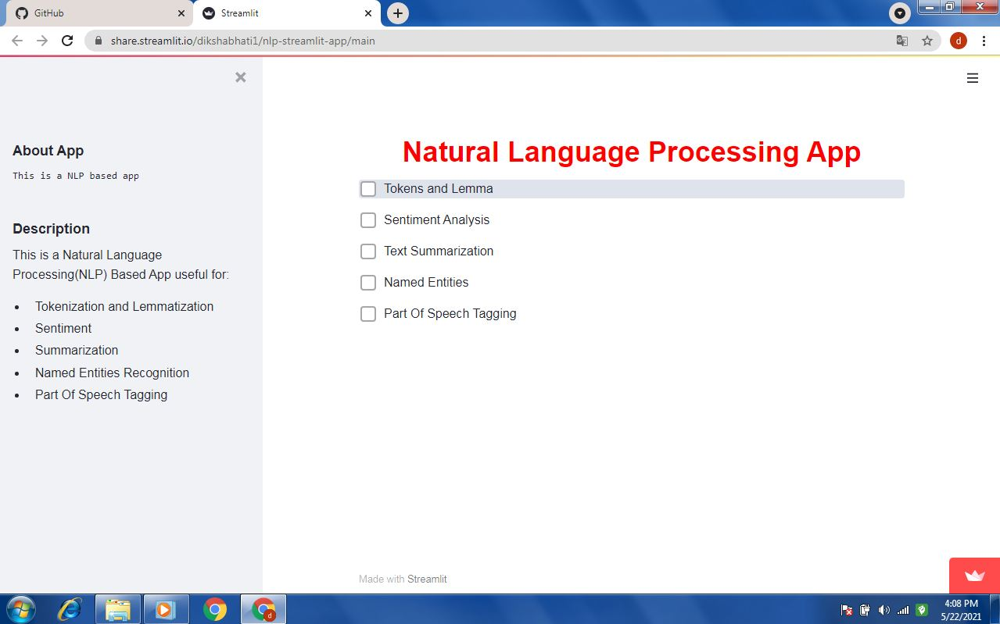
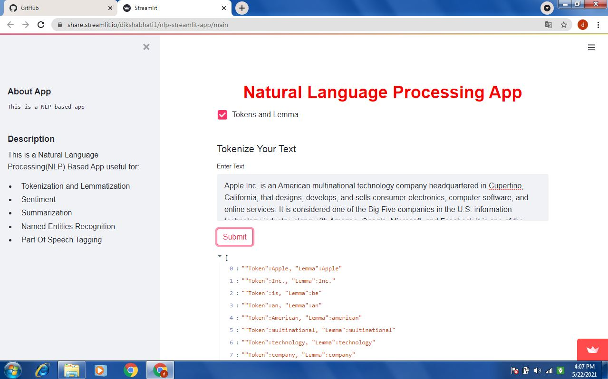
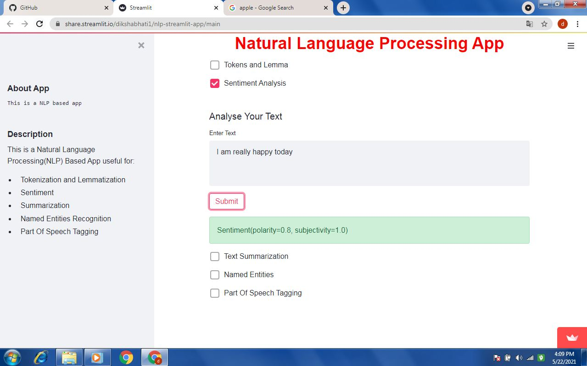
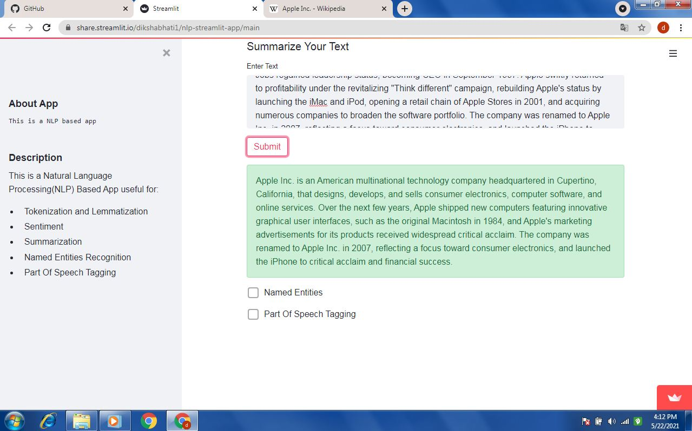
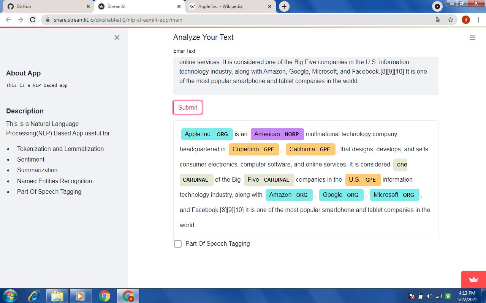

# Overview
This is a Natural Learning Processing Streamlit App which I have made in google colab that too without signing into ngrok.It is a basic
app which do multiple nlp task.Following is covered in NLP streamlit app:
- Tokenization and Lemmatization
- Text Summarization
- Named Entities
- Part of Speech Tagging
- Sentiment Analysis

# Weekly Forum
This Natural Language Processing App is included in the weekly Roundup on the streamlit community form  

 

# Demo
Here is the link to the web app you can check it out : https://share.streamlit.io/dikshabhati1/pandas-profiling-app/main/app.py  

 

 

 

 

